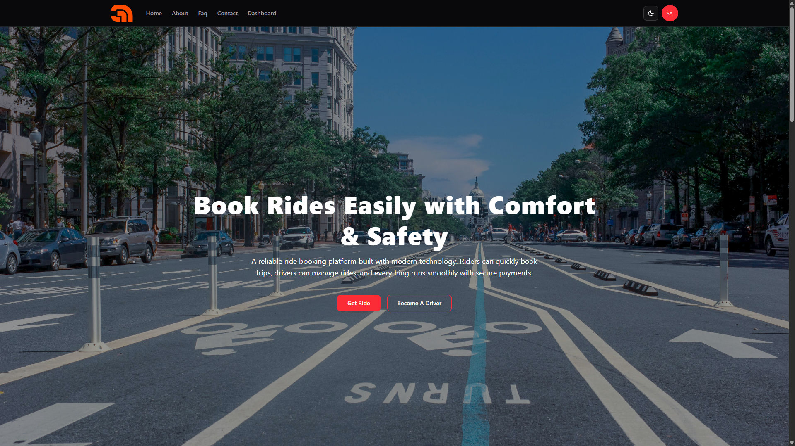
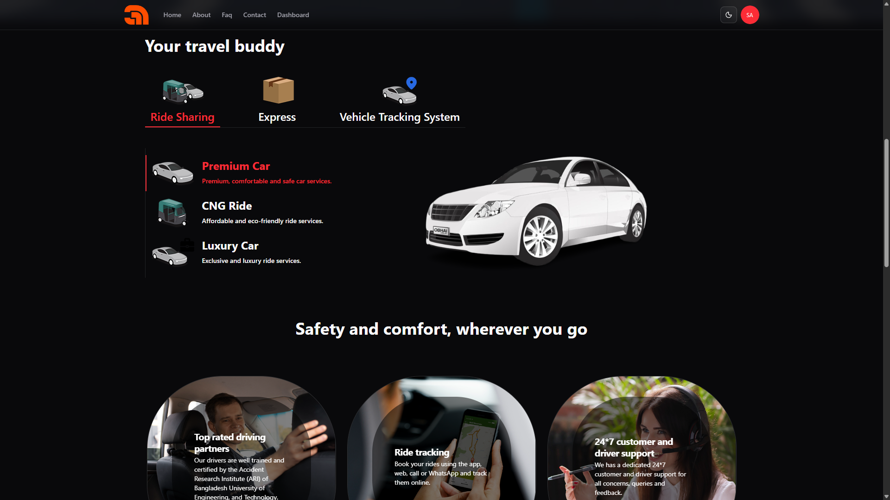
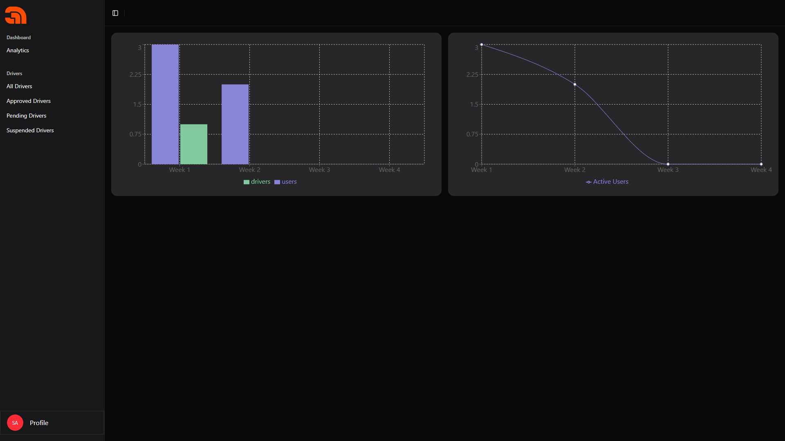

# Ride Management System – Frontend (React + Redux Toolkit + RTK Query)

A **production-grade, fully responsive, and role-based ride booking platform** (similar to Uber/Pathao) built with **React, Redux Toolkit, RTK Query, Tailwind CSS**.  
Supports **Rider, Driver, and Admin dashboards** with real-time updates, secure authentication, and a professional UI/UX.

---

## Live Demo

- **Frontend:** [Ride Booking Frontend](https://ridebooking-lilac.vercel.app/)
- **Backend API:** [Ride Booking Backend](https://ride-booking-apis.vercel.app/)

---

## Project Overview

This platform allows **Riders** to book rides, **Drivers** to accept/manage rides, and **Admins** to monitor the entire system.  
The project features **role-based dashboards, responsive design, live ride tracking, emergency SOS functionality**.

---

## Features

### Public Pages

- Home (Hero, Features, Testimonials, CTA, Promotions)
- About Us (Company background, mission, team)
- Features (Rider, Driver, Admin capabilities)
- Contact (Validated form)
- FAQ (Searchable)

---

### Authentication & Authorization

- JWT-based login & registration
- Role selection (Rider/Driver)
- Persistent session management
- Account status handling (Blocked/Suspended → Redirect with info)
- Logout functionality

---

### Rider Dashboard

- Ride request form (Pickup, Destination, Fare estimate, Payment)
- Ride history (Search, Filter, Pagination)
- Ride details (Map, Driver info, Status timeline)
- Profile management (Name, Phone, Password)
- SOS button (Call Police, Notify Contact, Share Location)

---

### Driver Dashboard

- Online/Offline toggle
- Incoming requests (Accept/Reject)
- Active ride management (Accepted → Picked Up → Completed/Cancelled)
- Earnings dashboard (Charts: Daily/Weekly/Monthly)
- Ride history (Search, Filter, Pagination)
- Profile management (Vehicle details, Password update)

---

### Admin Dashboard

- User management (Search, Filter, Block/Unblock, Approve/Suspend)
- Ride oversight (All rides with advanced filters)
- Analytics dashboard (Charts: Ride volume, Revenue trends, Driver activity)
- Profile management

---

### Emergency / SOS

- Floating SOS button (Active ride only)
- Options: Call Police, Notify Emergency Contact (Email/Phone), Share Location
- Pre-saved emergency contacts
- Location sharing via SMS/WhatsApp/email
- Real-time feedback (toast/confirmation messages)

---

### General UI/UX Enhancements

- Responsive Navbar (Role-based)
- Sidebar + Profile dropdown
- Data tables with search & filter
- Recharts (Bar, Line, Pie)
- Skeleton loaders & smooth transitions
- Lazy-loading for heavy assets (Maps, Tables)
- Global error handling with toast notifications

---

## Upcoming Features

- **Auto Driver Selection** (System automatically assigns nearest/available driver – no manual selection)
- **Emergency Phone Number** (Now users can add both email)
- **Payment System Integration** (Stripe/PayPal/bKash/Nagad support for cashless payments)
- **Live Ride Tracking** (Real-time map updates for riders & drivers)
- **Real-time Updates with Socket.io** (Instant ride status updates, notifications, and live communication)

---

## Tech Stack

**Frontend:** React, Redux Toolkit, RTK Query, Tailwind CSS, TypeScript  
**Backend:** Node.js, Express.js, MongoDB, JWT, bcrypt  
**Visualization:** Recharts  
**Notifications:** react-hot-toast  
**Maps:** Google Maps API / Leaflet.js

---

## Setup Instructions

### Run Project

```bash
# Clone the repository
git clone https://github.com/codeWith-Repon/ride-management-frontend
cd ride-management-frontend

# Install dependencies
npm install

# Run development server
npm run dev

# Build for production
npm run build
```

### Frontend Environment Variable

```bash
VITE_BASE_URL=https://ride-booking-apis.vercel.app/api/v1
```

add this your .env file

Demo Credentials

Use these accounts to test different roles:

Super Admin / Admin

- Email: superadmin@super.com
- Password: Repon@123

Driver

- Email: reponahmedofficial@gmail.com
- Password: Repon@123

Rider

- Email: repon7253@gmail.com
- Password: Repon@123

  


